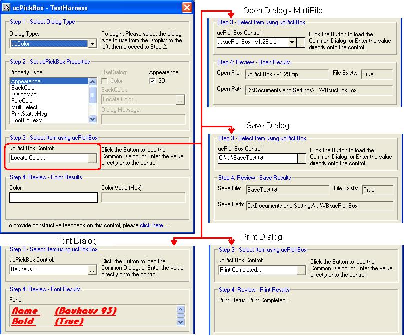



## ucPickBox

### Description

*Update 28Jun06* (v1.8.134) - Fixed minor bug in TrimPathByLen method and made it printer object independent. *Update 27Mar06 (v1.8.132)* &#8211; Added initial path subclassing CallBack for BrowseForFolder to allow initial path selection without external bas modules. Added Path Let Property and fixed several annoying bugs. Current version is stable and has been tested for several months prior to release... UserControl and TestHarness Updated...Enjoy!

Update 04Jan06 (v1.32) &#8211; Support for Shell32 BrowseForFolder Added and TestHarness Updated.

Update 06Jan06 (v1.33) &#8211; Minor bug fix in the DialogMsg when DialogType = ucFolder Updated UserControl and TestHarness.

As a developer, one of the most mundane tasks I frequently encounter is the wiring-up and managing of the CommonDialog Controls. The ucPickBox has been designed as a lightweight (~80kb), drop in place, API implementation of the CommonDialog Controls which takes much of this hassle away! ucPickBox provides Color, Font, Open (Single / Mutlifile), Save and Print dialog support, while providing a clean GUI to display the results for both 3D and Flat visual styles. In addition, this UserControl exposes 44 Properties, 14 Methods, 13 Events, and 88 Dialog Flags as enumerations which makes it flexible and easy to use. Among the exposed function are handy tools like: ExractPath, ExtractFilename, FileExists, LongToHexColor, QualifyPath, TranslateColor, and TrimPathByLen. The enclosed project provides an extensive test-harness and documentation to explore the many facets of this UserControl. Enjoy!
 
### More Info
 

             |
---                |---
**Submitted On**   |2006-06-29 00:26:42
**By**             |[TerriTop](https://github.com/Planet-Source-Code/PSCIndex/blob/master/ByAuthor/territop.md)
**Level**          |Intermediate
**User Rating**    |5.0 (109 globes from 22 users)
**Compatibility**  |VB 5\.0, VB 6\.0
**Category**       |[Custom Controls/ Forms/  Menus](https://github.com/Planet-Source-Code/PSCIndex/blob/master/ByCategory/custom-controls-forms-menus__1-4.md)
**World**          |[Visual Basic](https://github.com/Planet-Source-Code/PSCIndex/blob/master/ByWorld/visual-basic.md)
**Archive File**   |[ucPickBox2003356292006\.zip](https://github.com/Planet-Source-Code/territop-ucpickbox__1-63905/archive/master.zip)

